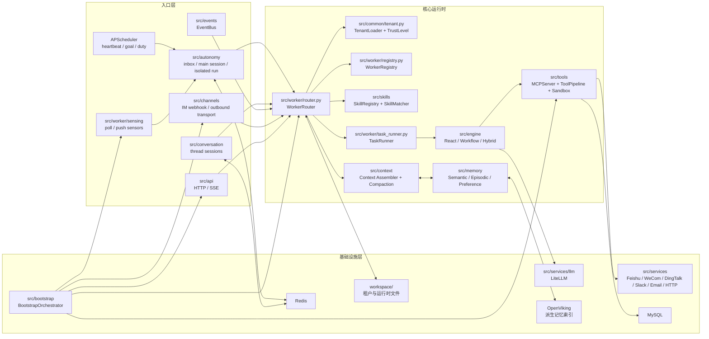
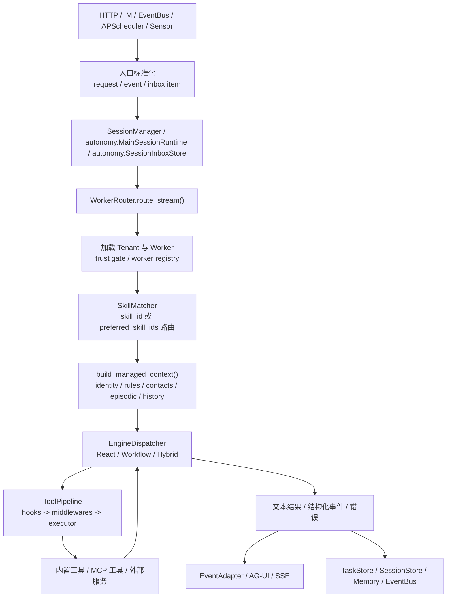
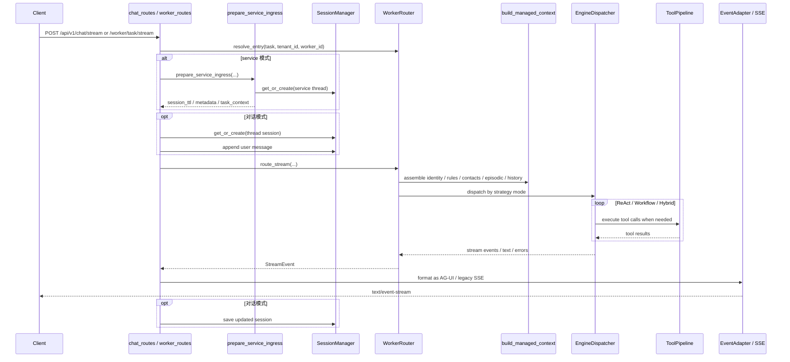
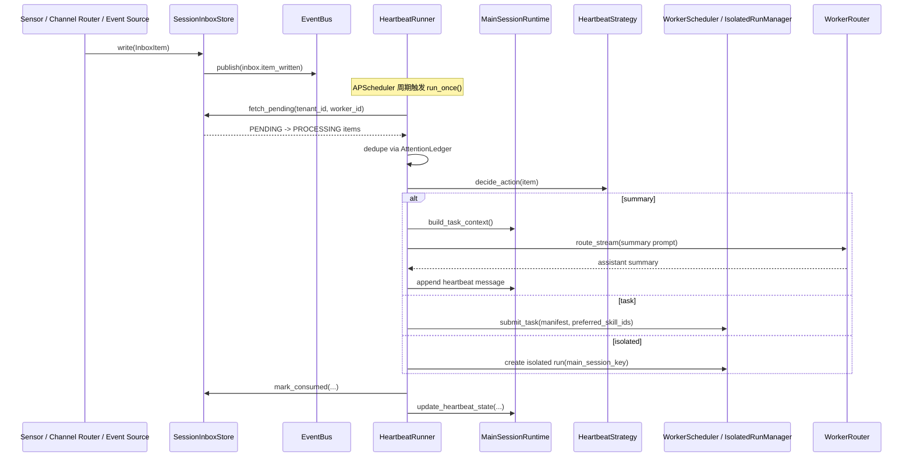
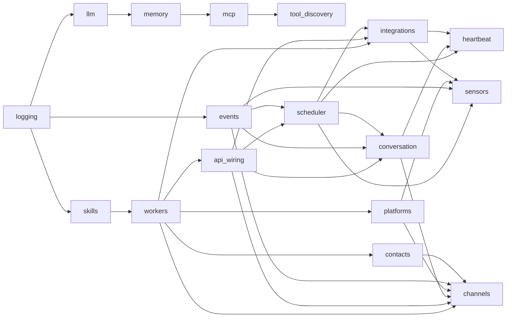
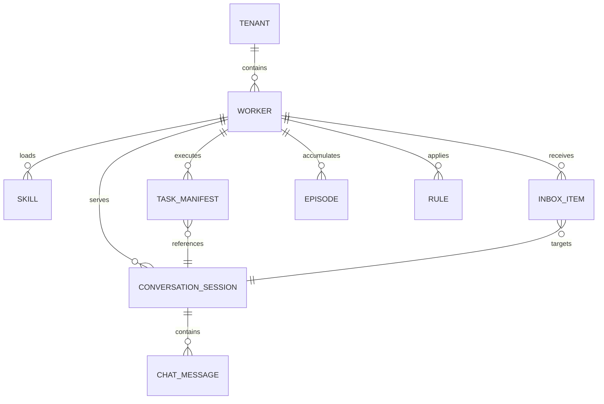

# genworker 架构说明

## 1. 项目概览

genworker 是一个面向多租户、多 Worker 的 Agent 编排平台。系统把来自 HTTP、IM、事件和定时任务的输入统一收敛到 `WorkerRouter`，再结合 Worker 定义、Skill 匹配、上下文管理、执行引擎、工具管线与记忆系统完成一次执行。

当前支持四类运行入口：

- `conversation`：多轮对话，会话状态由 `src/conversation/` 管理。
- `task`：一次性任务，请求直接进入 Worker 执行链路。
- `event-driven`：事件总线驱动 Duty 或外部事件响应。
- `autonomous`：Heartbeat、Goal 检查、Sensor 轮询等后台自治流程，由 `src/autonomy/` 承载自治运行时对象。

### 技术栈

| 层级 | 技术选型 |
|------|---------|
| HTTP 与流式输出 | FastAPI + Uvicorn + SSE |
| 执行引擎 | ReAct / Workflow / Hybrid |
| 模型路由 | LiteLLM |
| 工具协议 | MCP |
| 持久化 | Redis + MySQL + workspace 文件系统 + OpenViking 派生索引 |
| 记忆后端 | OpenViking（统一检索索引） |
| 调度 | APScheduler |
| 数据模型 | `@dataclass(frozen=True)` 为主 |

补充边界：

- 默认社区运行形态为 `filesystem-first`，`Redis / OpenViking` 均为可选增强
- `MySQL` 当前视为 enterprise-only 依赖，不属于默认 `genworker` 导出路径

### 1.1 运行时底座

运行时底座统一了后端选择、fallback 和对外状态表达：

- 组件状态统一使用 `ComponentStatus`：`disabled / ready / degraded / failed`
- 组件运行态通过 `src/common/runtime_status.py` 的 `ComponentRuntimeStatus` 暴露
- `/health` 只负责进程存活与轻量探针
- `/readiness` 负责默认聊天主链路是否可服务
- `/api/v1/debug/runtime` 负责输出 profile、default worker、依赖状态和关键组件当前后端
- 启动完成后会输出统一 `[Runtime]` 摘要日志，并在 profile 与依赖开关不一致时输出 warning

## 2. 整体架构

### 2.1 分层架构图



### 2.2 内部主要领域与关系

| 领域 | 主要模块 | 关系 |
|------|---------|------|
| 接入层 | `src/api/`、`src/channels/` | 接收外部请求或消息；`channels` 同时统一出站 transport 适配器 |
| 会话层 | `src/conversation/` | 维护 thread session 与会话恢复 |
| 自治运行时 | `src/autonomy/` | 维护 main session、heartbeat inbox、isolated run 等后台认知运行时 |
| Worker 运行时 | `src/worker/` | 负责租户加载、Worker 选择、信任控制、Skill 路由、上下文拼装、任务提交 |
| 执行层 | `src/engine/`、`src/streaming/` | 按策略模式执行任务，并把内部事件编码为 SSE/AG-UI 事件流 |
| 工具层 | `src/tools/` | 提供工具注册、发现、权限过滤、中间件、执行审计与沙箱 |
| 记忆与上下文 | `src/memory/`、`src/context/` | 检索长期/情景记忆，控制 token 预算，并对历史进行渐进压缩 |
| 感知与自治 | `src/worker/sensing/`、`src/worker/heartbeat/`、`src/worker/duty/`、`src/worker/goal/` | 把外部变化转为事实、任务或主会话认知输入 |
| 平台服务 | `src/services/` | 封装 LLM、数据库、Redis、邮件和 IM 平台客户端；共享注册与生命周期模板放在 `src/services/client_registry.py` |
| 启动编排 | `src/bootstrap/` | 负责依赖排序、初始化顺序和应用生命周期 |
| Lifecycle Intelligence | `src/worker/lifecycle/` | 维护 task/goal/duty provenance、suggestion、feedback、detector 与 goal projector 闭环 |

### 2.2.1 执行引擎边界

当前执行引擎分为五档：

- `AUTONOMOUS`：`src/engine/react/agent.py`，自由 ReAct 循环
- `DETERMINISTIC`：`src/engine/workflow/engine.py`，严格线性步骤
- `HYBRID`：`src/engine/hybrid/engine.py`，混合顺序步骤
- `PLANNING`：`src/worker/planning/enhanced_executor.py`，运行时 LLM 拆解 DAG
- `LANGGRAPH`：`src/engine/langgraph/`，发版前定义的状态机、条件边、循环和人工 interrupt

推荐选型：

- 结构固定、需要 checkpoint / interrupt / loop：选 `LANGGRAPH`
- 结构要在运行时由模型拆解：选 `PLANNING`
- 目标开放、依赖自由工具探索：选 `AUTONOMOUS`

### 2.3 脚本执行通道

执行层现在额外支持“脚本化一次工具调用”：

- L1 临时脚本：LLM 直接调用 `execute_code`
- L2 绑定脚本：`TaskManifest.pre_script` / `Duty.pre_script`
- L3 可复用脚本：从 `SCRIPT_TOOL_DIR` 扫描加载的 `ScriptTool`
- Goal 侧的 `default_pre_script` 现在会覆盖两条派生路径：health-check follow-up 直接任务，以及带 `goal_id` provenance 的 planning/subagent 执行链路

统一原则：

- 所有脚本最终都走同一条 `ToolPipeline`
- 脚本内调用其他工具时，仍然会经过 policy / hooks / middleware / audit
- `pre_script` 的唯一执行点在 `TaskRunner.execute()`
- 含 `hidden_from_llm` tag 的 L3 脚本工具不会进入 LLM schema，也不会被 `tool_search` 发现
- 对于带 `goal_id` provenance 的 planning/subagent 任务，`default_pre_script` 会先进入 `WorkerContext`，再由 subagent adapter 构造 manifest 继续走 `TaskRunner` 统一执行

当前关键路径：

- `src/tools/builtin/execute_code_tool.py`
- `src/tools/builtin/code_rpc_bridge.py`
- `src/tools/builtin/script_tool.py`
- `src/tools/builtin/script_tool_registry.py`
- `src/worker/scripts/`

## 2.3 LLM 分层调度

LLM 调度拆成四层：

1. 调用点用 `src/services/llm/intent.py` 的 `LLMCallIntent` 声明业务语义。
2. `src/services/llm/routing_policy.py` 的 `TableRoutingPolicy` 按 `Purpose + flags` 选择 tier。
3. `src/services/llm/router_adapter.py` 通过 `tier_aliases` 把 tier 解析为 LiteLLM model group。
4. LiteLLM Router 负责同组负载均衡、重试和 fallback。

当前 tier 包括 `fast / standard / strong / reasoning`，并为 tool-use 单独维护
四个 base tier。`requires_tools` 保留在 `LLMCallIntent` 中，但由
`TableRoutingPolicy` 内部消化；其中 `fast + tools` 会软升级到 `standard`，
避免轻量模型承担不稳定的工具调用。默认 fallback 链为：

- `reasoning -> strong -> standard -> fast`

适配器会为每次请求记录 `purpose`、`tier`、请求 model group 和实际响应 model，
用于成本归因、fallback 观察和延迟分析。

补充说明：

- `src/channels/router.py` 入口层现在带有一个“按需跨渠道历史回查”兜底逻辑：仅在消息疑似接续旧事、且本地 session FTS 能命中其他渠道历史时，才先提醒用户确认；确认后再把压缩摘要注入 `task_context`。该逻辑是低频入口补偿，不进入常规每轮上下文装配路径。

## 3. 主要数据流程

### 3.1 主数据流程图



### 3.2 各入口如何进入统一管线

| 入口 | 首层模块 | 进入统一执行链路的方式 |
|------|---------|----------------------|
| 对话流 | `src/api/routes/chat_routes.py` | 先经 `SessionManager`，再进入 `WorkerRouter.route_stream()` |
| 任务流 | `src/api/routes/worker_routes.py` | 直接进入 `WorkerRouter.route_stream()` |
| IM 双向消息 | `src/channels/router.py` | 路由为对话消息或感知事实，再进入会话层、自治运行时或 Worker 管线；当前支持 `feishu / wecom / dingtalk / email / slack` |
| 事件驱动 | `src/events/` + `src/worker/duty/` | 事件匹配 Duty 后提交给 `WorkerScheduler` / `WorkerRouter` |
| Sensor / Heartbeat / Goal 检查 | `src/worker/sensing/` + `src/worker/heartbeat/` + `src/autonomy/` | 先写入 `SessionInboxStore`，再由 `HeartbeatRunner` 决定总结、任务或 isolated run |

### 3.3 一次执行中的关键决策点

1. 入口先确定 `tenant_id`、`worker_id`、`thread_id` 或 `main_session_key`。
2. `TenantLoader` 和 `WorkerRegistry` 决定租户边界、默认 Worker 与工具权限上界。
3. `SkillMatcher` 在显式 `skill_id`、软偏好 `preferred_skill_ids` 与自然语言意图之间做最终匹配。
4. `build_managed_context()` 组装身份、约束、规则、联系人、情景记忆、历史消息和工具结果。
5. `EngineDispatcher` 根据 Skill 策略选择 ReAct、Workflow 或 Hybrid。
6. 工具调用统一经过 `ToolPipeline`，再进入内置工具、MCP 工具或外部服务。
7. 如果 `TaskManifest.pre_script` 非空，`TaskRunner` 会先执行脚本并把 stdout 注入任务文本。
8. 对 `execute_code` / `ScriptTool` 而言，子进程内的工具调用会通过 RPC bridge 回到同一条 `ToolPipeline`。
9. 结果同步写回任务、会话、记忆和事件流。
10. post-run lifecycle hook 会补充 task 与 goal/duty 的显式关联，并在满足条件时生成 pending suggestion。

### 3.4 Lifecycle 联动

新增的 lifecycle intelligence layer 现在挂在现有执行链路上，而不是单独开一条执行路径：

- `TaskManifest` 增加了 `provenance` 和 `gate_level`
- `task_hooks` 会把 `related_goals` / `related_duties` 写入 episodic memory
- `GoalProgressProjector` 会把关联 task 的结果回写到 `GOAL.md`
- `SuggestionStore` / `FeedbackStore` 会沉淀待审批建议和结构化反馈
- `scheduler_runtime` 会周期运行 repeated task / goal completion / duty drift detectors
- Skill 进化链也挂在同一层：`DutySkillDetector` 负责 `Duty -> Skill` suggestion，`crystallizer` 在有 `suggestion_store` 时把 `Rule -> Skill` 改为 suggestion；两条路径都通过 `/approve_suggestion` 物化为 `skills/{skill_id}/SKILL.md`
- `channels` 内置命令支持 `/suggestions`、`/approve_suggestion`、`/reject_suggestion`、`/feedback`
- 对于 `gate_level="gated"` 的派生 task，系统会写入 `task.confirmation_requested` inbox item，而不是直接执行；用户可通过 `/confirmations`、`/approve_confirmation`、`/reject_confirmation` 完成确认流
- 对于 `LANGGRAPH` interrupt，系统会写入 `langgraph.interrupt`（或 skill 自定义审批 event type）inbox item；同样复用 `/approve_confirmation`、`/reject_confirmation` 完成恢复

### 3.4 对话/任务请求时序图



说明：

- chat 路由先进入 `SessionManager`，worker task 路由可以直接进入 `WorkerRouter`。
- service 模式会先经过 `prepare_service_ingress()`，补齐会话 TTL、排队状态、`service_profile_context` 和稳定 thread。
- SSE 只负责协议编码，真正的业务事件来自 `WorkerRouter` 和执行引擎。

### 3.5 感知与 Heartbeat 时序图



说明：

- 感知层不会直接决定最终执行方式，它先把事实写入 Inbox。
- `HeartbeatStrategy` 把事实分成 `summary`、`task`、`isolated` 三类。
- `summary` 走主会话认知回合，`task` 进入标准调度链，`isolated` 创建带 `main_session_key` 的独立执行。

## 4. 核心模块说明

### 4.1 API 与流式输出

| 模块 | 职责 |
|------|------|
| `src/api/app.py` | FastAPI 应用工厂、生命周期入口、路由装配 |
| `src/api/routes/chat_routes.py` | 对话流式入口与任务查询接口 |
| `src/api/routes/worker_routes.py` | Worker 任务流式入口、运维概览、Worker 局部重载 |
| `src/api/routes/channel_routes.py` | IM webhook 接入与渠道状态查询 |
| `src/streaming/` | 内部 `StreamEvent` 到 SSE/AG-UI 协议的编码适配 |

### 4.2 Worker 运行时

| 模块 | 职责 |
|------|------|
| `src/worker/models.py` | Worker、ServiceConfig、HeartbeatConfig、ToolPolicy 等核心定义 |
| `src/worker/parser.py` | 解析 `PERSONA.md` frontmatter 和正文 |
| `src/worker/registry.py` | Worker 注册、默认 Worker 与关键词匹配 |
| `src/worker/loader.py` | Worker 磁盘装载、技能合并和标准运行时目录补齐 |
| `src/worker/router.py` | 统一编排入口，负责 worker/skill 决策并驱动执行 |
| `src/worker/tool_scope.py` | 组装 per-run tool bundle、task tools、session search 与 execution scope |
| `src/worker/runtime_context.py` | 装载 learned rules、episodic/profile/preference/decision 上下文并生成 `WorkerContext` |
| `src/worker/task_runner.py` | 负责一次运行的执行包装、回调与学习反馈 |
| `src/worker/scheduler.py` | 统一接收 duty、goal、heartbeat、isolated run 产生的任务 |
| `src/worker/scheduler_effects.py` | 处理调度完成事件、isolated run 通知与 dead-letter 持久化 |
| `src/worker/trust_gate.py` | 基于租户信任等级决定 bash、remote MCP、episodic write 等能力边界 |

说明：

- `WorkerRouter` 现在保留 facade 角色，不再内联大段工具注入和历史上下文装载逻辑。
- `tool_scope` 与 `runtime_context` 共同承担运行期装配职责，使 router 更接近应用编排层。
- `load_worker_entry()` 已下沉到 `src/worker/loader.py`，供 bootstrap 和热重载共用，避免 runtime 反向依赖 composition root。
- `WorkerScheduler` 现在更聚焦并发配额与重试队列，副作用发布逻辑下沉到 `scheduler_effects`。

### 4.3 执行引擎

| 模块 | 职责 |
|------|------|
| `src/engine/router/engine_dispatcher.py` | 根据 Skill 策略模式派发引擎 |
| `src/engine/react/agent.py` | ReAct 自主推理与工具调用循环 |
| `src/engine/workflow/engine.py` | 确定性工作流执行 |
| `src/engine/hybrid/engine.py` | 组合自主步骤与确定性步骤 |
| `src/engine/tools/subagent_tool.py` | Worker 内部 SubAgent 并行编排工具 |

### 4.4 工具框架

| 模块 | 职责 |
|------|------|
| `src/tools/mcp/server.py` | 工具注册中心 |
| `src/tools/pipeline.py` | 工具执行管线 |
| `src/tools/sandbox.py` | 工具权限过滤 |
| `src/tools/middlewares/` | 权限、schema 校验、超时、审计、脱敏 |
| `src/tools/builtin/` | `bash_execute`、文件读写、搜索、网页抓取、agent 委托等内置工具 |

### 4.5 上下文与记忆

| 模块 | 职责 |
|------|------|
| `src/context/assembler.py` | 组装最终上下文片段 |
| `src/context/budget_allocator.py` | 分配 system、history、rules、memory 等 token 配额 |
| `src/context/compaction/` | 负责 tool trim、history prune、history summarize、reactive recovery |
| `src/memory/orchestrator.py` | 统一语义记忆、情景记忆、偏好提取与故障隔离 |
| `src/memory/episodic/` | 情景记忆存储、检索、衰减与关联反馈 |
| `src/memory/preferences/` | 偏好与长期决策抽取 |

说明：

- 语义记忆与情景记忆的检索统一由 OpenViking 承担；`workspace/.../memory/episodes/*.md` 仍是 source of truth，OpenViking 只保存派生索引。
- 情景记忆写入统一收口到 `write_episode_with_index()`：先落 Markdown，再 best-effort 建 OpenViking 索引；索引失败会记日志并保留源文件，不阻断主执行链路。
- `WorkerRuntimeContextBuilder` 会把 task `provenance` 中的 `goal_id` / `duty_id` 注入 `MemoryOrchestrator.query()`，让 episodic 检索可以带 metadata filter 收窄范围。
- `MemoryOrchestrator` 对 provider 查询采用 fault isolation + 5 秒超时；当 OpenViking 不可用时返回空记忆结果，执行链路按 fail-open 降级，不再保留本地 4D retriever fallback。

### 4.6 会话、感知与自治

| 模块 | 职责 |
|------|------|
| `src/conversation/session_manager.py` | thread session 与 main session 生命周期管理 |
| `src/autonomy/inbox.py` | 感知事实的三态 Inbox 存储与原子消费 |
| `src/autonomy/main_session.py` | 主会话状态、heartbeat 元数据和 isolated run 汇总 |
| `src/autonomy/isolated_run.py` | 隔离执行任务创建与回流 |
| `src/worker/heartbeat/runner.py` | 消费 Inbox，决定总结、任务或 isolated run |
| `src/worker/sensing/registry.py` | 管理 Email、Webhook、Git、Workspace File 等 sensor |
| `src/worker/duty/trigger_manager.py` | EventBus 事件到 Duty 的匹配与调度 |
| `src/worker/goal/progress_checker.py` | Goal 偏差检测与进展评估 |

说明：

- `src/conversation/` 根包只暴露 thread session 与 task spawning；自治运行时请直接从 `src/autonomy/` 导入。
- `src/conversation/main_session.py`、`src/conversation/isolated_run.py`、`src/conversation/inbox/store.py` 仅保留历史兼容路径。

### 4.7 Channel Transport

| 模块 | 职责 |
|------|------|
| `src/channels/outbound.py` | 统一 Email/Feishu/WeCom/DingTalk 出站适配器、重试与多通道回退 |
| `src/channels/outbound_types.py` | `ChannelMessage`、`SenderScope`、`RetryConfig` 等共享出站模型 |
| `src/channels/bindings.py` | worker-scoped channel binding 构造与凭据过滤 helper |
| `src/channels/router.py` | IM 入站总入口，负责命令判定、对话转发、sensor 路由和完成通知订阅 |
| `src/worker/integrations/worker_scoped_channel_gateway.py` | 按 `tenant_id + worker_id + channel_type` 解析 worker-scoped 出站 transport |

说明：

- `src/channels/` 现在同时承载 IM ingress 和 outbound transport 边界。
- `build_worker_bindings()` 已下沉到 `src/channels/bindings.py`，供 channel bootstrap 和 runtime refresh 共用。
- `src/worker/integrations/` 保留兼容导出与业务集成逻辑，不再重复定义通道适配器实现；仓库内部实现应直接依赖 `src/channels/outbound.py` 与 `src/channels/outbound_types.py`。
- `src/worker/integrations/domain_models.py` 承载解析/同步领域模型，`src/worker/integrations/models.py` 仅保留兼容 re-export。
- `src/runtime/channel_runtime.py` 承担 thread/task context 计算、stream 聚合和 task completion 通知拼装，避免 router 继续膨胀。

### 4.8 启动编排

`src/bootstrap/` 使用 `BootstrapOrchestrator` 按依赖顺序初始化系统。当前主链路包含：

```text
logging
  -> events
  -> llm
  -> memory
  -> mcp
  -> tool_discovery
  -> skills
  -> workers
  -> api_wiring
  -> scheduler
  -> conversation
  -> platforms
  -> contacts
  -> channels
  -> integrations
  -> sensors
  -> heartbeat
```

其中 `src/runtime/` 继续吸收原本堆积在 composition root 的应用服务逻辑：

- `src/runtime/api_wiring.py`：承载 `ApiWiringInitializer` 的依赖解析、memory orchestrator、task runner 与 worker router 装配实现。
- `src/runtime/bootstrap_builders.py`：承载 tool executor、planning stack、direct llm fallback 等装配 builder。
- `src/runtime/app_state.py`：承载 `app.state` 注入、fallback router 组装、persona watcher 生命周期。
- `src/runtime/channel_runtime.py`：承载 channel thread/task context、stream reply 聚合与完成通知拼装。
- `src/runtime/integration_runtime.py`：承载外部内容桥接、goal sync/approval 订阅和 auto-goal 策略解析。
- `src/runtime/scheduler_runtime.py`：承载 goal health check、周期作业与 per-worker scheduler/trigger 注册逻辑。
- `src/runtime/task_hooks.py`：承载任务后处理、失败反馈、memory flush 回调。
- `src/runtime/worker_refresh.py`：承载 contact/trigger/goal/sensor/channel 等子系统的 reload refresh 逻辑。
- `src/runtime/worker_reload.py`：承载 worker 运行时热重载与进程内刷新服务。

这样 `src/bootstrap/__init__.py` 主要负责初始化顺序与模块聚合；`src/bootstrap/api_wiring_init.py` 承载 initializer 壳，`src/bootstrap/compat.py` 承载历史兼容导出，根模块仅通过懒加载转发旧入口，不再在根模块堆放大块业务实现。

### 4.9 平台服务边界

| 模块 | 职责 |
|------|------|
| `src/services/client_registry.py` | 提供 keyed singleton registry、显式初始化和按数据库名关闭等共享生命周期模板 |
| `src/services/mysql/client.py` | 实现 MySQL 连接池、查询/事务协议，并复用共享 registry 处理多库实例管理 |
| `src/services/redis/client.py` | 实现 Redis 连接池与 KV/集合操作，并复用共享 registry 处理默认实例生命周期 |

说明：

- `src/services/` 内允许各客户端保留协议差异，但注册、按库派生配置、初始化和关闭模板应优先下沉到共享 helper。
- 基础服务包优先保持 `config.py + client.py (+ exceptions.py)` 的平铺结构，避免把配置模型继续混进客户端实现文件。
- `mysql/redis` 这类基础服务不再各自维护一套单例与初始化样板，避免服务层横向分叉。

### 4.10 兼容层约束

当前仓库仍保留少量历史导入路径，但这些模块都属于 external-only compatibility layer：

- `src/conversation/main_session.py`
- `src/conversation/isolated_run.py`
- `src/conversation/inbox/store.py`
- `src/worker/integrations/models.py`
- `src/worker/integrations/channel_adapter.py`
- `src/worker/integrations/direct_email_adapter.py`
- `src/worker/integrations/wecom_channel_adapter.py`
- `src/worker/integrations/dingtalk_channel_adapter.py`
- `src/bootstrap/compat.py`
- `src/bootstrap/worker_init.py` 中的 `load_worker_entry` 兼容别名

约束：

- 仓库内部实现与测试不得继续新增对这些兼容层的依赖。
- 新代码必须直接依赖 `src/autonomy/`、`src/channels/`、`src/runtime/`、`src.worker.loader` 等主路径。
- 兼容层只用于外部旧调用方平滑迁移，不再承担新的业务实现。
- 截至 2026-04-13，已对 `src/` 与 `tests/` 做兼容层导入扫描，内部代码不再命中上述历史路径。

更准确地说，运行时启动顺序是依赖拓扑，而不是严格单链。核心依赖关系如下：



## 5. 运行时数据结构

### 5.1 运行时对象关系图



### 5.2 核心运行时对象

| 对象 | 模块 | 作用 |
|------|------|------|
| `Tenant` | `src/common/tenant.py` | 多租户隔离边界，提供 trust level、默认 Worker、租户级工具策略 |
| `Worker` | `src/worker/models.py` | Worker 身份、模式、工具策略、service/heartbeat/sensor/channel 配置 |
| `TaskManifest` | `src/worker/task.py` | 一次任务的生命周期快照 |
| `ConversationSession` | `src/conversation/models.py` | thread/main session 的统一持久化载体 |
| `InboxItem` | `src/autonomy/inbox.py` | 感知层写入的结构化事实 |
| `Event` | `src/events/models.py` | 进程内事件总线的统一事件格式 |
| `ContextWindowConfig` | `src/context/models.py` | 上下文预算、压缩阈值和各 segment 配额 |
| `Episode` | `src/memory/episodic/models.py` | 情景记忆条目 |
| `Rule` | `src/worker/rules/models.py` | directive / learned 规则实体 |

### 5.3 Workspace 布局

```text
workspace/
├── system/
│   └── skills/
│       └── {skill_name}/SKILL.md
└── tenants/
    └── {tenant_id}/
        ├── TENANT.json
        ├── sessions/
        │   └── {session_id}.json
        ├── skills/
        │   └── {skill_name}/SKILL.md
        └── workers/
            └── {worker_id}/
                ├── PERSONA.md
                ├── CHANNEL_CREDENTIALS.json        # 可选
                ├── runtime/
                │   ├── inbox.json
                │   └── heartbeat_meta.json
                ├── skills/
                │   └── {skill_name}/SKILL.md
                ├── contacts/
                │   ├── configured/
                │   ├── discovered/
                │   └── index.jsonl
                ├── duties/
                ├── goals/
                ├── rules/
                │   ├── directives/
                │   └── learned/
                ├── memory/
                │   └── episodes/
                ├── tasks/
                │   └── active/
                ├── sensor_snapshots/
                └── archive/
```

### 5.4 Workspace 配置文件参数说明

#### `TENANT.json`

| 字段 | 类型 | 作用 |
|------|------|------|
| `tenant_id` | `string` | 租户唯一标识，目录名与文件内容必须一致 |
| `name` | `string` | 租户展示名 |
| `trust_level` | `0-3` | 租户信任等级，控制 bash、remote MCP、规则写入、episodic write 等能力边界 |
| `tool_policy.denied_tools` | `string[]` | 租户级禁用工具列表，作为全租户安全覆盖层 |
| `mcp_remote_allowed` | `boolean` | 是否允许远程 MCP 发现或访问 |
| `default_worker` | `string` | 未显式指定 `worker_id` 时的默认 Worker |
| `credentials` | `object` | 租户级凭据扩展位，当前代码可读取该字段，但主要平台凭据已下沉到 Worker 目录 |

#### `PERSONA.md` frontmatter

`PERSONA.md` 由 YAML frontmatter 和 Markdown 正文组成。frontmatter 负责结构化配置，正文作为长期系统指令注入 Prompt。

##### 顶层字段

| 字段 | 类型 | 作用 |
|------|------|------|
| `identity` | `object` | Worker 身份、角色与人格描述 |
| `mode` | `personal \| team_member \| service` | 决定上下文注入方式、会话策略与服务边界 |
| `tool_policy` | `object` | Worker 级工具黑白名单 |
| `skills_dir` | `string` | Worker 私有 Skill 目录，默认 `skills/` |
| `default_skill` | `string` | Worker 默认 Skill |
| `constraints` | `string[]` | 执行约束，注入系统 Prompt |
| `sensor_configs` | `object[]` | 传感器配置列表，决定轮询/推送事实如何进入 Inbox |
| `channels` | `object[]` | IM 渠道绑定配置 |
| `contacts` | `object[]` | 预置联系人档案 |
| `contact_settings` | `object` | 联系人目录的存储与上下文注入策略 |
| `service` | `object` | `mode=service` 时的会话和升级策略 |
| `heartbeat` | `object` | Worker 级 heartbeat 判定覆盖项 |

兼容别名：

- `monitor_configs` 会被解析为 `sensor_configs`。
- `configured_contacts` 会被解析为 `contacts`。
- `contacts_config` 会被解析为 `contact_settings`。

##### `identity`

| 字段 | 类型 | 作用 |
|------|------|------|
| `identity.name` | `string` | Worker 展示名 |
| `identity.worker_id` | `string` | Worker 唯一标识，目录名通常与其对应 |
| `identity.version` | `string` | Worker 定义版本号 |
| `identity.role` | `string` | 角色描述 |
| `identity.department` | `string` | 所属部门 |
| `identity.reports_to` | `string` | 汇报对象 |
| `identity.background` | `string` | 背景知识与职责边界 |
| `identity.personality.traits` | `string[]` | 人格特征 |
| `identity.personality.communication_style` | `string` | 输出风格 |
| `identity.personality.decision_style` | `string` | 决策偏好 |
| `identity.principles` | `string[]` | 高优先级原则 |

##### `tool_policy`

| 字段 | 类型 | 作用 |
|------|------|------|
| `tool_policy.mode` | `blacklist \| whitelist` | 黑名单或白名单模式 |
| `tool_policy.denied_tools` | `string[]` | 禁用工具列表 |
| `tool_policy.allowed_tools` | `string[]` | 白名单模式下允许的工具列表 |

##### `sensor_configs[]`

| 字段 | 类型 | 作用 |
|------|------|------|
| `source_type` | `string` | 传感器类型，如 `email`、`webhook`、`workspace_file`、`git` |
| `poll_interval` | `string` | 轮询间隔，如 `5m`、`30m` |
| `delivery_mode` | `string` | 事实投递模式扩展位 |
| `filter` | `object` | 传感器过滤条件 |
| `auto_create_goal` | `boolean` | 是否自动由事实生成 Goal |
| `require_approval` | `boolean` | 由事实生成 Goal 或任务时是否需要人工批准 |
| `cognition_route_override` | `string` | 覆盖默认认知路由 |
| `routing_rules[]` | `object[]` | 按字段、模式和匹配方式将事实分类到不同 route |
| `fallback_route` | `string` | 未命中规则时的默认 route |

##### `channels[]`

| 字段 | 类型 | 作用 |
|------|------|------|
| `type` | `string` | 渠道类型，如 `feishu`、`wecom`、`dingtalk`、`email` |
| `connection_mode` | `string` | 连接方式，如 webhook、polling |
| `chat_ids` | `string[]` | 绑定的会话或群组 ID |
| `reply_mode` | `string` | 回复策略，如完整回复、流式回复、卡片更新 |
| `features` | `object` | 渠道特性开关，例如群聊监控 |

##### `contacts[]`

| 字段 | 类型 | 作用 |
|------|------|------|
| `person_id` | `string` | 联系人唯一标识 |
| `name` | `string` | 联系人主名称 |
| `role` | `string` | 角色 |
| `organization` | `string` | 所属组织 |
| `notes` | `string` | 备注 |
| `confidence` | `number` | 档案置信度 |
| `identities[]` | `object[]` | 跨渠道身份，如邮箱、IM handle |
| `social_circles` | `string[]` | 社交圈分组 |
| `hierarchy_level` | `string` | 组织层级标记 |
| `aliases` | `string[]` | 别名 |
| `tags` | `string[]` | 自定义标签 |
| `service_count` | `number` | 服务模式下的互动计数 |
| `common_topics` | `string[]` | 常见主题 |

##### `contact_settings`

| 字段 | 类型 | 作用 |
|------|------|------|
| `workspace_root` | `string` | 联系人存储根目录 |
| `discovered_dir` | `string` | 自动发现联系人目录名 |
| `configured_dir` | `string` | 手工配置联系人目录名 |
| `index_file` | `string` | 联系人索引文件名 |
| `context_limit` | `number` | 注入 Prompt 的联系人数量上限 |

##### `service`

| 字段 | 类型 | 作用 |
|------|------|------|
| `knowledge_sources[]` | `object[]` | service 模式专用知识源列表 |
| `session_ttl` | `number` | service 会话 TTL，单位秒 |
| `max_concurrent_sessions` | `number` | 最大并发会话数 |
| `anonymous_allowed` | `boolean` | 是否允许匿名访问 |
| `escalation.enabled` | `boolean` | 是否允许升级到人工或其他 Worker |
| `escalation.target_worker` | `string` | 升级目标 Worker |
| `escalation.triggers` | `string[]` | 触发升级的条件描述 |

##### `heartbeat`

| 字段 | 类型 | 作用 |
|------|------|------|
| `goal_task_actions` | `string[]` | 哪些 goal action 应直接转为标准 task |
| `goal_isolated_actions` | `string[]` | 哪些 goal action 应转为 isolated run |
| `goal_isolated_deviation_threshold` | `number` | goal 偏差阈值，超过后更倾向 isolated run |

#### `CHANNEL_CREDENTIALS.json`

该文件位于 `workspace/tenants/{tenant_id}/workers/{worker_id}/CHANNEL_CREDENTIALS.json`，用于 Worker 级平台凭据装载。

##### `feishu`

| 字段 | 类型 | 作用 |
|------|------|------|
| `app_id` | `string` | 飞书应用 ID |
| `app_secret` | `string` | 飞书应用密钥 |

##### `wecom`

| 字段 | 类型 | 作用 |
|------|------|------|
| `corpid` | `string` | 企业微信 CorpID |
| `corpsecret` | `string` | 企业微信应用密钥 |
| `agent_id` | `string` | 企业微信 Agent ID |

##### `dingtalk`

| 字段 | 类型 | 作用 |
|------|------|------|
| `app_key` | `string` | 钉钉应用 Key |
| `app_secret` | `string` | 钉钉应用 Secret |
| `robot_code` | `string` | 钉钉机器人编码 |

##### `email`

| 字段 | 类型 | 作用 |
|------|------|------|
| `worker_address` | `string` | Worker 发信地址 |
| `worker_username` | `string` | Worker 邮箱用户名 |
| `worker_password` | `string` | Worker 邮箱密码 |
| `worker_imap_host` | `string` | Worker IMAP 主机 |
| `worker_imap_port` | `number` | Worker IMAP 端口 |
| `worker_smtp_host` | `string` | Worker SMTP 主机 |
| `worker_smtp_port` | `number` | Worker SMTP 端口 |
| `owner_address` | `string` | 所属人邮箱地址 |
| `owner_username` | `string` | 所属人邮箱用户名 |
| `owner_password` | `string` | 所属人邮箱密码 |
| `owner_imap_host` | `string` | 所属人 IMAP 主机 |
| `owner_imap_port` | `number` | 所属人 IMAP 端口 |
| `owner_smtp_host` | `string` | 所属人 SMTP 主机 |
| `owner_smtp_port` | `number` | 所属人 SMTP 端口 |

### 5.5 持久化位置与对应对象

| 路径 | 对应对象 | 说明 |
|------|---------|------|
| `workspace/tenants/{tenant_id}/TENANT.json` | `Tenant` | 租户静态配置 |
| `workspace/tenants/{tenant_id}/sessions/{session_id}.json` | `ConversationSession` | thread/main session 文件存储 |
| `workspace/tenants/{tenant_id}/workers/{worker_id}/PERSONA.md` | `Worker` | Worker 定义与长期系统指令 |
| `workspace/tenants/{tenant_id}/workers/{worker_id}/tasks/active/{task_id}.json` | `TaskManifest` | 任务生命周期快照 |
| `workspace/tenants/{tenant_id}/workers/{worker_id}/memory/episodes/*.md` | `Episode` | 情景记忆条目 |
| `workspace/tenants/{tenant_id}/workers/{worker_id}/rules/directives/*.md` | `Rule` | 指令性规则 |
| `workspace/tenants/{tenant_id}/workers/{worker_id}/rules/learned/*.md` | `Rule` | 学习得到的规则 |
| `workspace/tenants/{tenant_id}/workers/{worker_id}/runtime/inbox.json` | `InboxItem` | Sensor/事件写入的事实 |
| `workspace/tenants/{tenant_id}/workers/{worker_id}/runtime/heartbeat_meta.json` | heartbeat meta | 主会话 heartbeat 游标、open concerns、task refs |
| `workspace/tenants/{tenant_id}/workers/{worker_id}/sensor_snapshots/*.json` | Sensor 快照 | 传感器状态与增量游标 |

### 5.6 环境配置加载

系统级环境变量由 `src/common/settings.py` 装载，优先级如下：

1. `configs/config.env`
2. 解析后的环境文件（本地默认是 `configs/config_local.env`）
3. `configs/config_local.env`（当第 2 步不是它时，作为最终本地覆盖）
4. 进程环境变量

入口 `start.py` 会先读取 `ENVIRONMENT` 或 `ENV`，再调用 `load_layered_env()`。当前仓库内的环境配置文件包括：

- `configs/config.env`
- `configs/config_local.env.example`

本地启动默认读取 `configs/config_local.env`，该文件不提交到 git，仓库提供 `configs/config_local.env.example` 作为模板。系统级配置负责提供 HTTP 服务、日志、MCP、Redis、MySQL、embedding、OpenViking、heartbeat、自动热刷新等参数；`workspace/` 中的租户和 Worker 配置则负责业务运行面的差异化配置。

LLM 路由和 provider 配置不再放在 `config.env` 体系里。本地开发从
`configs/litellm_local.json` 读取，该文件不提交到 git，仓库提供
`configs/litellm_local.json.example` 作为模板；非本地环境通过启动期注入 provider
提供 LiteLLM 配置。当前 `src/services/llm/config_source.py` 负责区分本地文件和
非本地注入来源；后续如果改为 Nacos，只需要替换这一层 provider。

## 6. 架构特征

| 模式 | 应用位置 | 作用 |
|------|---------|------|
| Registry | `SkillRegistry`、`WorkerRegistry`、`MCPServer` | 支持运行时发现与组合 |
| Pipeline | `ToolPipeline`、`BootstrapOrchestrator` | 将多阶段处理拆分为稳定步骤 |
| Strategy | `EngineDispatcher`、`HeartbeatStrategy` | 在不同模式下替换执行策略 |
| Facade | `WorkerRouter`、`MemoryOrchestrator` | 向上提供简化入口 |
| Protocol / 接口隔离 | `LLMClient`、`ToolExecutor`、`EventBusProtocol` | 降低具体实现耦合 |
| 不可变数据 | `@dataclass(frozen=True)` | 避免运行时隐式副作用 |
| 渐进压缩 | `src/context/compaction/` | 在 token 压力下保留高价值上下文 |
| 多租户安全边界 | `Tenant` + `TrustGate` + `ToolPolicy` | 统一控制高风险能力暴露 |

## 7. 测试结构

| 目录 | 用途 |
|------|------|
| `tests/unit/` | 单模块行为验证 |
| `tests/integration/` | 跨模块协同验证 |
| `tests/e2e/` | 完整请求链路验证 |
